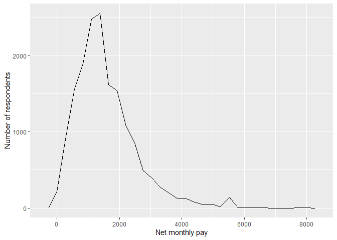
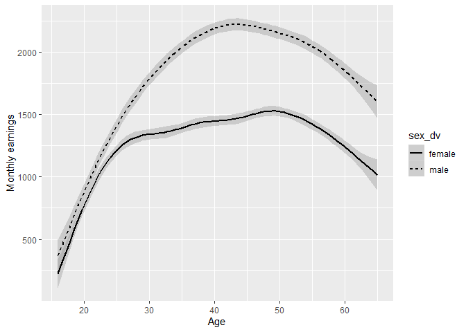
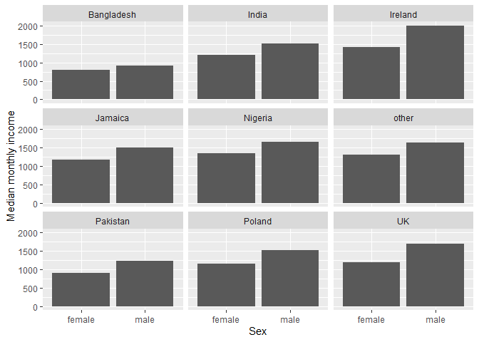
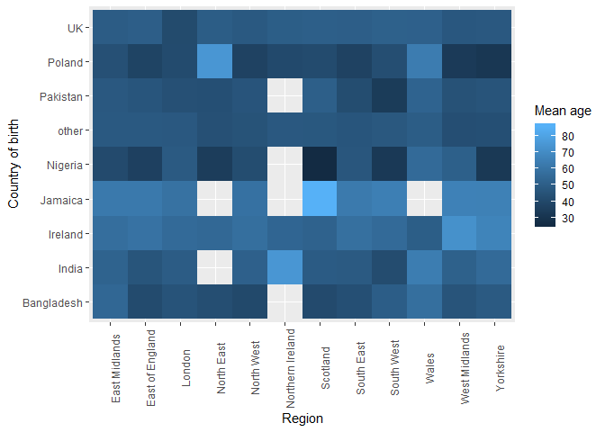
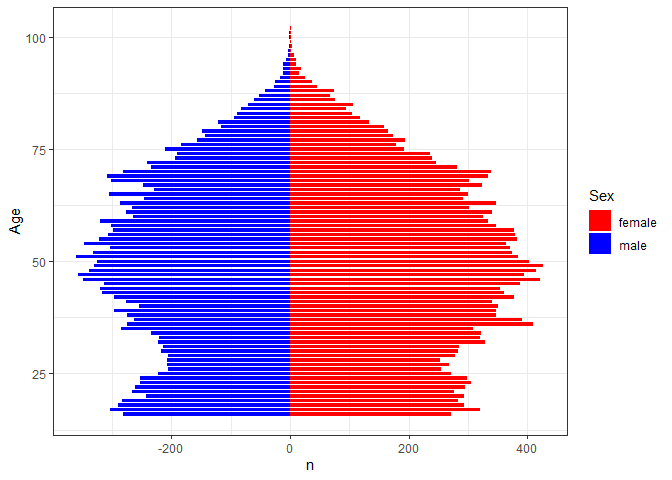

Statistical assignment 4
================
Ryan Kennelly- 129549
29.02.2020

In this assignment you will need to reproduce 5 ggplot graphs. I supply
graphs as images; you need to write the ggplot2 code to reproduce them
and knit and submit a Markdown document with the reproduced graphs (as
well as your .Rmd file).

First we will need to open and recode the data. I supply the code for
this; you only need to change the file paths.

    ```r
    library(tidyverse)
    Data8 <- read_tsv("C:/Users/ryan_/Documents/Data/UKDA-6614-tab/tab/ukhls_w8/h_indresp.tab")
    Data8 <- Data8 %>%
        select(pidp, h_age_dv, h_payn_dv, h_gor_dv)
    Stable <- read_tsv("C:/Users/ryan_/Documents/Data/UKDA-6614-tab/tab/ukhls_wx/xwavedat.tab")
    Stable <- Stable %>%
        select(pidp, sex_dv, ukborn, plbornc)
    Data <- Data8 %>% left_join(Stable, "pidp")
    rm(Data8, Stable)
    Data <- Data %>%
        mutate(sex_dv = ifelse(sex_dv == 1, "male",
                           ifelse(sex_dv == 2, "female", NA))) %>%
        mutate(h_payn_dv = ifelse(h_payn_dv < 0, NA, h_payn_dv)) %>%
        mutate(h_gor_dv = recode(h_gor_dv,
                         `-9` = NA_character_,
                         `1` = "North East",
                         `2` = "North West",
                         `3` = "Yorkshire",
                         `4` = "East Midlands",
                         `5` = "West Midlands",
                         `6` = "East of England",
                         `7` = "London",
                         `8` = "South East",
                         `9` = "South West",
                         `10` = "Wales",
                         `11` = "Scotland",
                         `12` = "Northern Ireland")) %>%
        mutate(placeBorn = case_when(
                ukborn  == -9 ~ NA_character_,
                ukborn < 5 ~ "UK",
                plbornc == 5 ~ "Ireland",
                plbornc == 18 ~ "India",
                plbornc == 19 ~ "Pakistan",
                plbornc == 20 ~ "Bangladesh",
                plbornc == 10 ~ "Poland",
                plbornc == 27 ~ "Jamaica",
                plbornc == 24 ~ "Nigeria",
                TRUE ~ "other")
        )
    ```

Reproduce the following graphs as close as you can. For each graph,
write two sentences (not more\!) describing its main message.

1.  Univariate distribution (20 points).
    
    ``` r
       Plot1<- Data %>%
        ggplot(aes(x = h_payn_dv)) +
        geom_freqpoly() +
        xlab("Net monthly pay") +
        ylab("Number of respondents")
    print(Plot1)
    ```
    
    <!-- -->
    Plot1 presents the findings that the majority of the respondents
    earn somewhere in the region of £500-£2000 per month, the steep
    slope shows that most people are earning over £1000 per month which
    is unsuprising as national minimum wage in the UK roughly makes
    about £1000 per month at 35-40 hours a week. There also seems to be
    a small peak between £5000-£6000, however I am unsure as to why that
    is.

2.  Line chart (20 points). The lines show the non-parametric
    association between age and monthly earnings for men and women.
    
    ``` r
    Data2 <- Data %>%
     select(sex_dv, h_payn_dv, h_age_dv) %>%
      filter(!is.na(sex_dv)) %>%
        group_by(h_age_dv, sex_dv)
    
    
    plot2 <- Data2 %>%
    ggplot(aes(x = h_age_dv, y = h_payn_dv, linetype = sex_dv)) +
    geom_smooth(colour = "black") +
    xlim(16, 65) +
    xlab("Age") +
    ylab("Monthly earnings")
    
    print(plot2)
    ```
    
    <!-- -->
    plot2 shows a clear disparity between the monthly earnings of males
    and females within the age group 30-80. At it’s heighest the gap
    presents that males in their 40s will earn up to £750 more than
    females of the same age.  

3.  Faceted bar chart (20 points).
    
    ``` r
       Data3 <- Data %>%
        select(sex_dv, placeBorn, h_payn_dv) %>%
        filter(!is.na(sex_dv)) %>%
        group_by(placeBorn, sex_dv) %>%
        summarise(
    medianIncome = median(h_payn_dv, na.rm = TRUE)) %>%
    na.omit(medianIncome)
    
    plot3 <- Data3 %>%
    ggplot(aes(x = sex_dv, y = medianIncome)) +
    geom_bar(stat = "identity") + 
    facet_wrap(~ placeBorn, ncol = 3) +
    xlab("Sex") +
    ylab("Median monthly income")
    print(plot3)
    ```
    
    <!-- -->
    Plot3 shows that the highest earners in the UK are men whos
    birthplace is Ireland and lowest are females whos birthplace is
    Bangladesh. Those born in other locations including the UK are round
    about the same yet women across the board earn a considerable amount
    less than men.

4.  Heat map (20 points).
    
    ``` r
    Data4 <- Data %>%
        select(h_gor_dv, placeBorn, h_age_dv) %>%
        group_by(placeBorn, h_gor_dv) %>%
        summarise(
    meanAge = mean(h_age_dv, na.rm = TRUE)) %>%
    na.omit(meanAge)
    
    Plot4 <- Data4 %>%
    ggplot(aes(x = h_gor_dv, y = placeBorn, fill = meanAge )) +
    geom_tile() +
    theme(axis.text.x = element_text(angle = 90)) +
    ylab("Country of birth") +
    xlab("Region") +
    labs(fill = "Mean age")
    print(Plot4)
    ```
    
    <!-- -->
    Plot4 presents that the oldest average age for region and country of
    birth are Jamaicans who live in Scotland, and on the opposite end
    the youngest average are Nigerians also in Scotland. It would also
    appear that there is missing data for Jamaicans living in the North
    East, Norther Ireland, and Wales this could be due to incredibly low
    populations of Jamaicans in these regions meaning they were not
    picked up by the survey.

5.  Population pyramid (20 points).
    
    ``` r
    Data5 <- Data %>%
      select(h_age_dv, sex_dv) %>%
      group_by(h_age_dv, sex_dv) %>% 
      summarise(Freq = n()) %>% 
      mutate(Freq = if_else(sex_dv == "male", -Freq, Freq))
    
    
    Plot5 <- Data5 %>%
        ggplot(aes(x = h_age_dv, y = Freq, group = h_age_dv, fill = sex_dv)) +
        geom_bar(stat = "identity", width = 0.75) +
        coord_flip() +
        labs(x = "Age", y = "n", fill = "Sex") +
        scale_fill_manual(values = c("red", "blue")) +
        theme_bw()
        print(Plot5)
    ```
    
    <!-- -->
    Plot5 shows an almost identically symetrical population pyrimid with
    a slightly higher population of females. This leads one to believe
    that the surveyers were carful to make sure that there was an even
    population spread over age and gender.
